# Corporate Actions Entitlement Calculator & Voluntary-Election Deadline Tracker

[](#)
[](https://n8n.io)
[](#)
[](#)
[](./LICENSE)

An enterprise-grade, deterministic **n8n automation workflow** designed for custody and asset servicing operations. The workflow ingests synthetic SWIFT MT564-shaped corporate action notifications, calculates cash and stock entitlements strictly against record-date position holdings, tracks voluntary election cutoff deadlines across a 4-tier escalation model, drafts bounded LLM client notifications, and records immutable audit logs.

---

## 1. Core Architecture & Workflow Pipeline

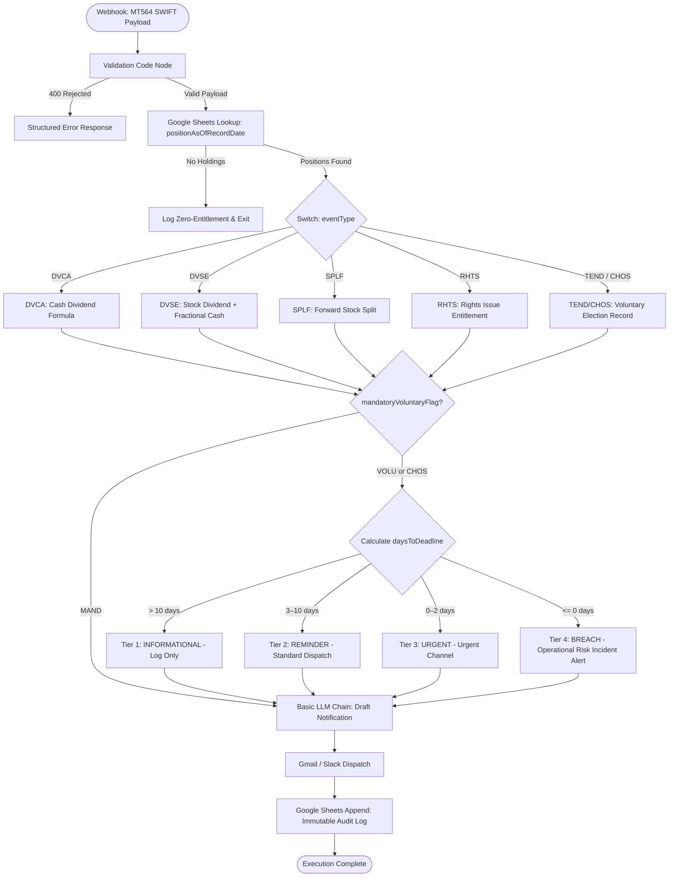

---

## 3. Live Execution & Workflow Screenshots

Below is the complete visual evidence of the production workflow running live on n8n Cloud, showing the end-to-end execution path, email dispatch notifications, and Google Sheets audit trail appending:

### Production n8n Workflow Pipeline Architecture (`workflow.json`)
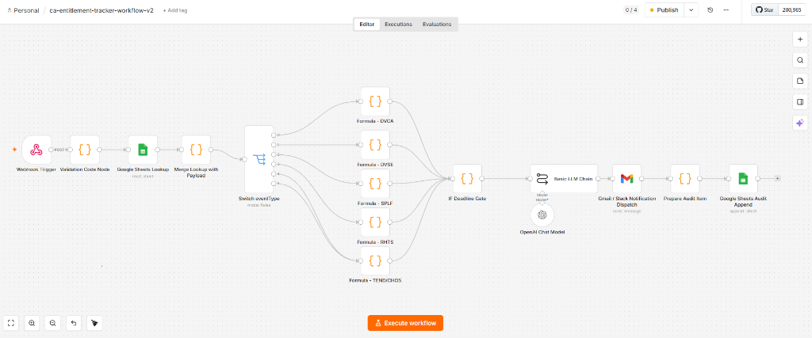

---

### Live Execution Proof — Grouped by Use Case

#### 🔹 Use Case 1: Mandatory Cash Dividend (`DVCA`)
**Scenario:** $0.50 rate on 10,000 shares → $5,000.00 cash entitlement (`NONE` escalation tier).

1. **n8n Execution Modal (#74):**
   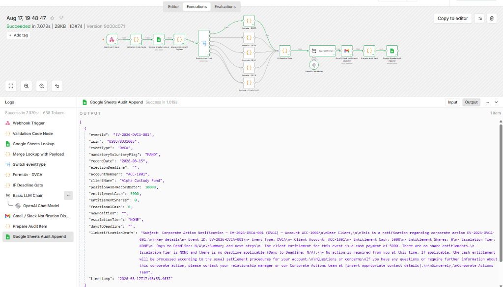
2. **Gmail Client Email Received:**
   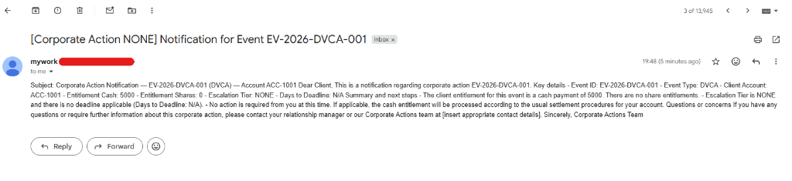
3. **Google Sheets Audit Log (Row 2):**
   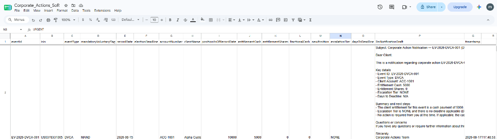

---

#### 🔹 Use Case 2: Voluntary Tender Offer (`TEND` — Urgent Escalation)
**Scenario:** 10,000 shares, election deadline 1 day remaining → `URGENT` escalation tier.

1. **n8n Execution Modal (#75):**
   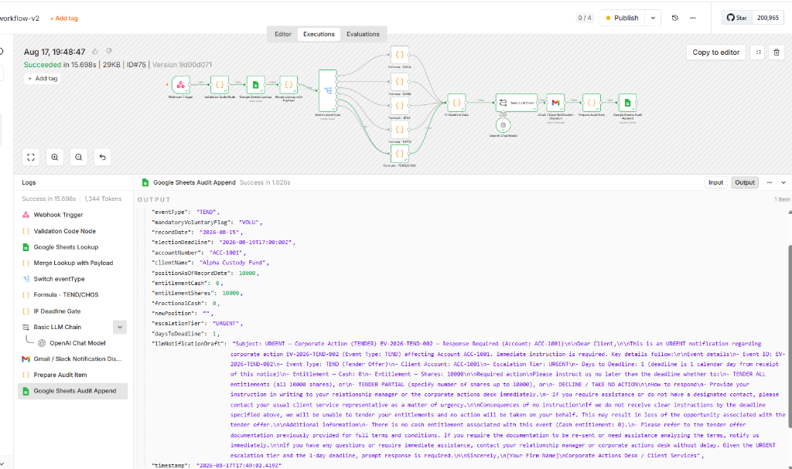
2. **Gmail Client Email Received:**
   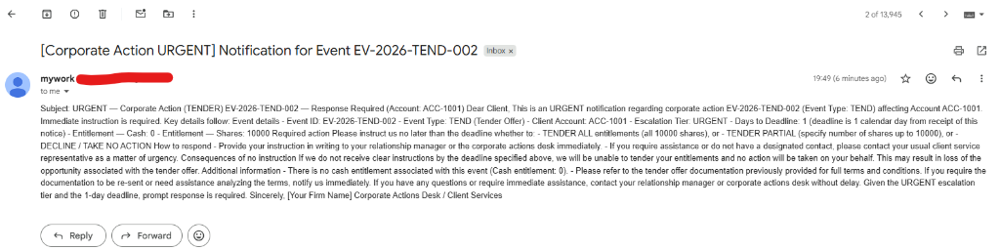
3. **Google Sheets Audit Log (Row 3):**
   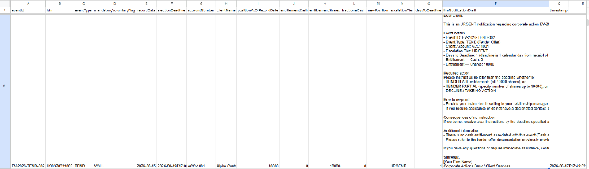

---

#### 🔹 Use Case 3: Voluntary Rights Subscription (`RHTS` — Operational Breach)
**Scenario:** 10,000 shares @ 0.20 ratio → 2,000 rights shares, deadline -2 days overdue → `BREACH` tier.

1. **n8n Execution Modal (#76):**
   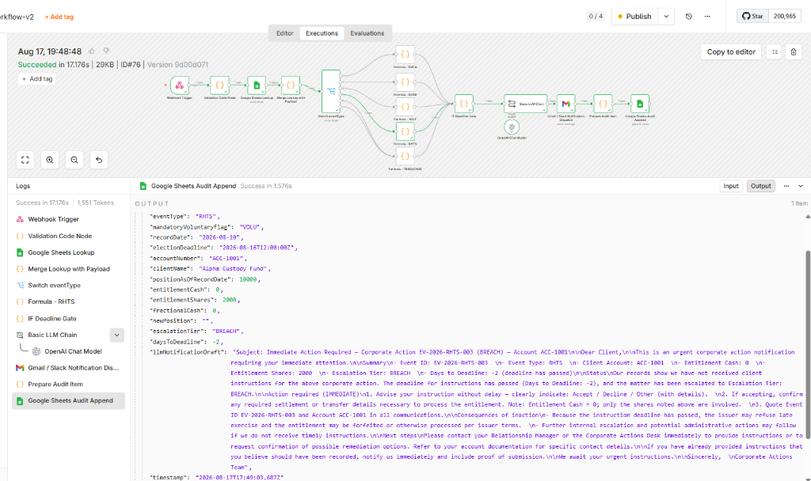
2. **Gmail Client Email Received:**
   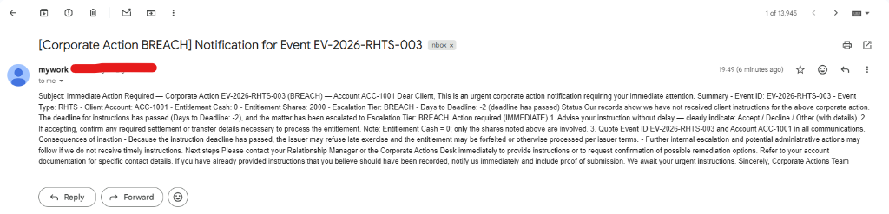
3. **Google Sheets Audit Log (Row 4):**
   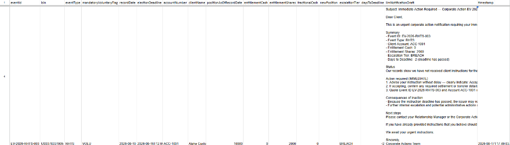

---

### Detailed Screenshot Correlation Matrix

| Screenshot | Stage / Component | Correlation & Execution Evidence |
|---|---|---|
| **[`n8n-final-v2-workflow-canvas.png`](./docs/assets/n8n-final-v2-workflow-canvas.png)** | **Full Pipeline Architecture** | Shows all 16 connected nodes in n8n Cloud (`v2`), including `Webhook Trigger`, `Validation`, `Google Sheets Lookup`, `Merge`, `Switch Routing`, 5 formula engines, `IF Deadline Gate`, `Basic LLM Chain` (`gpt-4o-mini`), `Gmail Dispatch`, `Prepare Audit Item`, and `Google Sheets Audit Append`. |
| **[`execution-74-dvca-success-v2.png`](./docs/assets/execution-74-dvca-success-v2.png)** | **Test Case 1 (`DVCA` Cash Dividend)** | **Execution #74:** Green status in 7.079s. Input: 10,000 shares @ $0.50 rate. Output shows `Google Sheets Audit Append` payload: `entitlementCash: 5000`, `escalationTier: "NONE"`, and complete `llmNotificationDraft`. |
| **[`execution-75-tend-urgent-success-v2.png`](./docs/assets/execution-75-tend-urgent-success-v2.png)** | **Test Case 2 (`TEND` Tender Offer)** | **Execution #75:** Green status in 15.698s. Input: 10,000 shares, deadline 1 day remaining. Output shows `entitlementShares: 10000`, `escalationTier: "URGENT"`, `daysToDeadline: 1`, and urgent LLM action draft. |
| **[`execution-76-rhts-breach-success-v2.png`](./docs/assets/execution-76-rhts-breach-success-v2.png)** | **Test Case 3 (`RHTS` Rights Issue Breach)** | **Execution #76:** Green status in 17.176s. Input: 10,000 shares @ 0.20 ratio, deadline -2 days overdue. Output shows `entitlementShares: 2000`, `escalationTier: "BREACH"`, `daysToDeadline: -2`, and operational risk escalation draft. |
| **[`gmail-dvca-body-received-v2.png`](./docs/assets/gmail-dvca-body-received-v2.png)** | **Client Email Dispatch (DVCA)** | Live email in Gmail with subject `[Corporate Action NONE] Notification for Event EV-2026-DVCA-001` containing pre-calculated financial entitlement details. |
| **[`gmail-tend-urgent-body-received-v2.png`](./docs/assets/gmail-tend-urgent-body-received-v2.png)** | **Client Email Dispatch (TEND Urgent)** | Live email in Gmail with subject `[Corporate Action URGENT] Notification for Event EV-2026-TEND-002` containing urgent tender response instructions. |
| **[`google-sheets-audit-trail-dvca-row.png`](./docs/assets/google-sheets-audit-trail-dvca-row.png)** | **Google Sheets Audit (Row 2)** | Shows live row appended in `AuditTrail` tab for `EV-2026-DVCA-001` across columns A–Q (`entitlementCash: 5000`, `NONE`, LLM draft, ISO timestamp). |
| **[`google-sheets-audit-trail-tend-row.png`](./docs/assets/google-sheets-audit-trail-tend-row.png)** | **Google Sheets Audit (Row 3)** | Shows live row appended in `AuditTrail` tab for `EV-2026-TEND-002` across columns A–Q (`entitlementShares: 10000`, `URGENT`, `daysToDeadline: 1`, LLM draft, ISO timestamp). |
| **[`google-sheets-audit-trail-rhts-row.png`](./docs/assets/google-sheets-audit-trail-rhts-row.png)** | **Google Sheets Audit (Row 4)** | Shows live row appended in `AuditTrail` tab for `EV-2026-RHTS-003` across columns A–Q (`entitlementShares: 2000`, `BREACH`, `daysToDeadline: -2`, LLM draft, ISO timestamp). |

---

## 4. Key Features

- **5 Deterministic Event Formulas:**
  - **DVCA (Cash Dividend):** Gross rate calculation with mandatory half-up rounding (`roundHalfUp`, 2 d.p.).
  - **DVSE (Stock Dividend):** Floor share allocation with fractional share cash payout computation.
  - **SPLF (Forward Split):** Non-fractional share multiplier against record-date holdings.
  - **RHTS (Rights Issue):** Auto-credit for mandatory rights; election record generation for voluntary rights.
  - **TEND / CHOS (Tender Offer / Choice Event):** Position locking and election option mapping.
- **Strict Custody Control Rule:** Entitlements are calculated **only** against `positionAsOfRecordDate`—never live or settlement-in-transit positions—preventing real-money operational losses.
- **4-Tier Voluntary Election Escalation Engine:**
  - **Informational (> 10 days):** Logged for operational tracking.
  - **Reminder (3–10 days):** Standard dispatch to account managers.
  - **Urgent (0–2 days):** Priority escalation route to risk desk.
  - **Breach (≤ 0 days):** Triggers immediate operational risk incident logging.
- **Bounded LLM Client Notifications:** Uses n8n Basic LLM Chain node (`gpt-4o-mini`) strictly as a natural-language formatting wrapper around pre-calculated, immutable financial figures. The LLM is explicitly forbidden from recalculating or estimating numbers.
- **Immutable Audit Logging:** Append-only logging of 17 structured execution parameters to Google Sheets for SOX and MiFID II compliance.

---

## 3. Regulatory & Standard Compliance Traceability

| Framework | Requirement / Article | Implementation Mechanism |
|---|---|---|
| **MiFID II** | Art. 25 Record-keeping | 17-field append-only audit trail capturing full lineage from MT564 ingestion to notification. |
| **SOX** | Internal Controls (Financial Data) | Code-node financial calculation lock; separation of calculation from text drafting. |
| **EU AI Act / ISO 42001** | Bounded AI Governance | Basic LLM Chain node restricted via zero-shot prompt guardrails and pre-computed inputs ([ADR-001](./docs/02a-architecture-decision-records/ADR-001-code-node-over-agent.md)). |
| **GDPR** | Art. 5(1)(c) Data Minimization | Account-level aggregation only; no end-client PII processed in LLM prompt payloads. |

---

## 4. Quickstart Guide

### Prerequisites
- n8n instance version **≥ 1.40**
- Google Account with Google Sheets API access
- OpenAI API key

### 1-Minute Setup
1. Clone the repository:
   ```bash
   git clone git@github-personal:mittalpk/ca-entitlement-tracker.git
   cd ca-entitlement-tracker
   ```
2. Follow [SETUP.md](./SETUP.md) to set up your mock Google Sheets System of Record (`Corporate_Actions_SoR`).
3. Import [`workflow.json`](./workflow.json) into n8n.
4. Attach credentials (Google Sheets OAuth, OpenAI API Key, Webhook Secret Header).
5. Trigger your first test webhook payload (see sample payloads in [SETUP.md](./SETUP.md)).

---

## 5. Repository Documentation Index

The complete 18-document specification suite and 37 user story specifications are located in [`docs/`](./docs/):

| Category | Document | Description |
|---|---|---|
| **Governance & Requirements** | [requirements.md](./requirements.md) | Primary IEEE 29148 / BABOK v3 specification document. |
| | [00-project-charter.md](./docs/00-project-charter.md) | Vision, scope, budget, RACI matrix, and success metrics. |
| **Architecture & Design** | [02-architecture-spec.md](./docs/02-architecture-spec.md) | C4 views, n8n node map, non-functional requirements allocation. |
| | [ADR-001 Code vs Agent Node](./docs/02a-architecture-decision-records/ADR-001-code-node-over-agent.md) | Architectural decision record specifying deterministic Code nodes over AI Agents. |
| | [ADR-002 Google Sheets SoR](./docs/02a-architecture-decision-records/ADR-002-google-sheets-mock-sor.md) | Decision record for mock System of Record structure. |
| | [03-data-contract.md](./docs/03-data-contract.md) | Data schemas, DAMA-DMBOK classifications, and data lifecycle. |
| | [03a-security-architecture.md](./docs/03a-security-architecture.md) | STRIDE threat model, secrets handling, Zero Trust design. |
| | [03b-ai-governance-model-card.md](./docs/03b-ai-governance-model-card.md) | ISO 42001 AI governance card and human-oversight controls. |
| **Logic & Testing** | [04-deterministic-logic-spec.md](./docs/04-deterministic-logic-spec.md) | Exact JavaScript formulas (`roundHalfUp`), pseudocode & flowcharts. |
| | [05-test-plan-edge-matrix.md](./docs/05-test-plan-edge-matrix.md) | Edge test matrix (unit, integration, E2E, UAT, malformed inputs). |
| **Operations & Risk** | [06-runbook.md](./docs/06-runbook.md) | Operational incident runbook and failure mode handling. |
| | [07-rollback-recovery.md](./docs/07-rollback-recovery.md) | Disaster recovery and workflow rollback procedures. |
| | [08-monitoring-slo-spec.md](./docs/08-monitoring-slo-spec.md) | Service Level Objectives (SLOs), alerts, and monitoring spec. |
| | [12-risk-register-raid-log.md](./docs/12-risk-register-raid-log.md) | RAID log, operational risk matrix, and mitigations. |
| **Backlog** | [User Story Index](./docs/backlog/INDEX.md) | 37 ordered user story specifications (`US-001` to `US-037`). |

---

## 6. License

Distributed under the [MIT License](./LICENSE). See `LICENSE` for more information.
