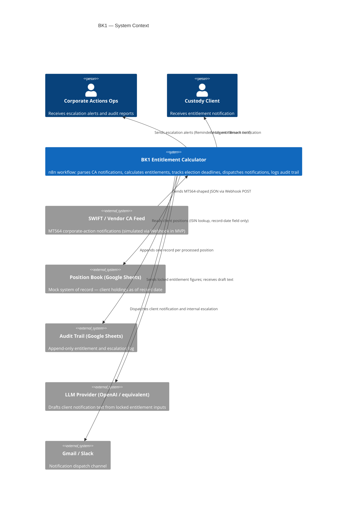
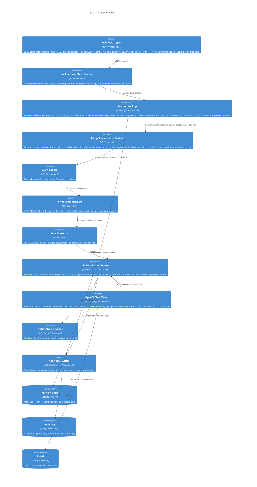
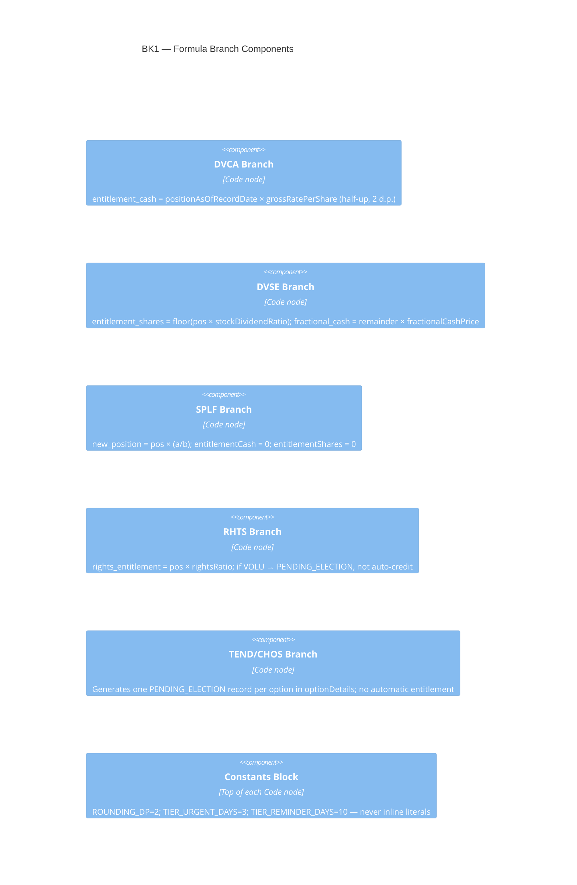

# 02 — Solution Architecture Specification

**Workflow ID:** BK1
**Document:** 02-architecture-spec.md
**Version:** 1.0
**Author role:** Senior AI Solution Architect
**Status:** Draft
**Last updated:** 2026-07-30

---

## How this fits

This document consumes `requirements.md` §8 (TOGAF architecture views) and `00-project-charter.md` (scope and success criteria) to produce a full solution architecture. It is consumed by `03-data-contract.md` (data flows), `03a-security-architecture.md` (trust boundaries), and `04-deterministic-logic-spec.md` (node-level logic). It does not reproduce requirements content — it references by ID.

---

## 1. Architecture principles

| Principle | Source | Application to BK1 |
|---|---|---|
| Separation of deterministic and AI logic | `requirements.md` BR-004 | LLM is confined to Basic LLM Chain; formula Code nodes have no LLM dependency |
| Append-only audit trail | `requirements.md` FR-024 | Google Sheets Append node; no UPDATE or DELETE path exists in the workflow |
| Credential isolation | `SETUP.md`; NFR-003 | All secrets stored in n8n credential store; no literal in node JSON |
| Twelve-Factor config | Twelve-Factor App §III | Escalation thresholds and formula constants defined as named constants at Code-node top — not embedded in logic |
| Zero external dependency at demo time | `requirements.md` NFR-008 | Synthetic data; mock Google Sheets; no live SWIFT feed |

---

## 2. C4 — Context diagram

---

## 3. C4 — Container diagram

> **Corrected 2026-08-16:** this diagram previously showed `sheetsLookup -> switchNode: "Event + position rows"` — implying the Sheets lookup passes the original webhook event through to the router. It doesn't: n8n's Google Sheets node in lookup mode *replaces* the item JSON with the matched row, dropping the webhook payload entirely. That false assumption was the exact root cause of a real bug (`BK1-ISS-004` in `.Archive/log.md`) that would have broken 100% of live requests — the Switch node routes on `eventType`, a field only the pre-lookup payload had. A `Merge Lookup with Payload` node was added between the lookup and the router to restore it; `llmChain` was also split into a chain node plus a separate `OpenAI Chat Model` node, since n8n's LangChain nodes require an explicit `ai_languageModel` connection rather than a bare credential on the chain node itself (`BK1-ISS-003`). Both are reflected below.

---

## 4. C4 — Component diagram (Formula Branches)

---

## 5. Technology stack

| Layer | Technology | Version | Rationale |
|---|---|---|---|
| Workflow engine | n8n Community Edition | ≥ 1.40 | See ADR-002 |
| Entitlement computation | n8n Code node (JavaScript) | Built-in | Deterministic, auditable, no external dependency |
| AI / NLG | Basic LLM Chain node | Built-in | See ADR-001 — Agent node explicitly prohibited |
| Position SoR (mock) | Google Sheets | Google Workspace | See ADR-002 |
| Audit trail | Google Sheets | Google Workspace | Append-only; no DB dependency for MVP |
| Notification | Gmail / Slack | n8n nodes | Configurable; no hard-coded channel |
| LLM provider | OpenAI GPT-4o (or equivalent) | Any n8n-supported | Provider-agnostic; credential is swappable |
| Hosting | n8n Cloud / self-hosted | — | EEA region preferred (GDPR-Art44-001) |

---

## 6. Integration points

| Integration | Direction | Protocol | Auth | Synthetic? |
|---|---|---|---|---|
| SWIFT/vendor CA feed | Inbound | HTTP POST / Webhook | Secret header token (NFR-003) | **Yes — simulated** |
| Google Sheets position book | Outbound read | Sheets API v4 | OAuth2 credential | **Yes — mock data** |
| Google Sheets audit trail | Outbound write | Sheets API v4 | OAuth2 credential | **Yes — mock data** |
| LLM provider | Outbound | REST / OpenAI API | API key credential | No (real API call) |
| Gmail / Slack | Outbound | SMTP / Slack API | OAuth2 / bot token credential | **Yes — test recipients** |

---

## 7. NFR allocation

| NFR ID | NFR | Architectural mechanism |
|---|---|---|
| NFR-001 | 30s end-to-end for ≤50 positions | Switch + parallel Code branches; no blocking synchronous loops |
| NFR-002 | 99.5% business-hours availability | n8n uptime monitoring (see `08-monitoring-slo-spec.md`) |
| NFR-003 | Credential isolation | n8n credential store; secret header on Webhook |
| NFR-004 | Data minimisation | Sheets schema limited to fields in `requirements.md` §6.4/§6.6 |
| NFR-005 | Reproducibility | No random or time-sensitive logic in formula nodes; `positionAsOfRecordDate` only |
| NFR-006 | Named constants | `CONST_*` block at top of every Code node |
| NFR-007 | Observability | Audit trail append + n8n execution log (see `08-monitoring-slo-spec.md`) |
| NFR-008 | Portability | All credentials as n8n credential store references; sample data bundled |

---

## 8. Architecture decisions

Key decisions are recorded as ADRs:

- **ADR-001** — Basic LLM Chain over Agent node (`02a-architecture-decision-records/ADR-001-code-node-over-agent.md`)
- **ADR-002** — Google Sheets as mock system of record (`02a-architecture-decision-records/ADR-002-google-sheets-mock-sor.md`)
