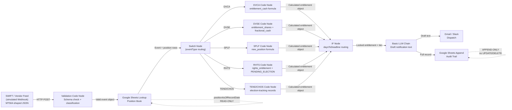

# 03 — Data Contract

**Workflow ID:** BK1
**Document:** 03-data-contract.md
**Version:** 1.0
**Author role:** Senior AI Solution Architect
**Status:** Draft
**Last updated:** 2026-07-30

---

## How this fits

This document consumes `requirements.md` §6 (data requirements & data model) and `02-architecture-spec.md` §6 (integration points) to produce the formal data contract governing every data exchange in BK1. It is consumed by `03a-security-architecture.md` (trust boundaries and data classification) and `09-governance-boundaries.md` (GDPR and DAMA-DMBOK traceability closure). It cross-references GDPR requirement IDs from `requirements.md` §7.1 and does not restate the underlying regulatory text.

---

## 1. DAMA-DMBOK data governance summary

| Attribute | Value |
|---|---|
| Data steward | Data Governance Lead (see `requirements.md` §2 RACI) |
| Data owner | Asset Servicing Risk & Control |
| Data quality owner | Technology / Workflow Engineer (formula correctness) |
| Classification authority | Compliance Officer |
| Lineage diagram | §3 below |
| Quality rules | §4 below |
| Retention / disposal | §5 below |

---

## 2. Data classification (DAMA-DMBOK + GDPR)

| Dataset | DAMA classification | GDPR category | PII? | Financial data? |
|---|---|---|---|---|
| Input payload (MT564-shaped) | Confidential — operational | Not special category | No (clientId is pseudonymous) | Yes |
| Position book (Google Sheets) | Confidential — financial | Not special category | Pseudonymous (clientId only) | Yes |
| Entitlement calculation outputs | Confidential — financial | Not special category | Pseudonymous | Yes |
| LLM prompt inputs | Confidential — operational | Not special category | Pseudonymous | Yes (locked figures) |
| LLM-drafted notification text | Internal — communications | Not special category | No (clientId only) | Yes (entitlement amounts) |
| Audit trail (Google Sheets) | Confidential — control record | Not special category | Pseudonymous | Yes |

> **Note on pseudonymity:** `clientId` is an institutional identifier (e.g. `C-10432`), not a natural-person name or national identifier. If clientId maps to a natural person in the originating system, GDPR applies. For MVP purposes, clientId is treated as pseudonymous and the full GDPR framework applies as a conservative choice (see GDPR-Art6-001).

---

## 3. Data lineage

---

## 4. Data quality rules

| Rule ID | Dataset | Rule | Enforcement point |
|---|---|---|---|
| DQ-001 | Input payload | `eventId` must be non-null, non-empty string | Validation Code node (FR-002) |
| DQ-002 | Input payload | `isin` must be exactly 12 characters | Validation Code node |
| DQ-003 | Input payload | `eventType` must be one of: DVCA, DVSE, SPLF, RHTS, TEND, CHOS | Validation Code node (FR-003) |
| DQ-004 | Input payload | `mandatoryVoluntaryFlag` must be one of: MAND, VOLU, CHOS | Validation Code node (FR-003) |
| DQ-005 | Input payload | `recordDate` must be a valid ISO 8601 date | Validation Code node (FR-002) |
| DQ-006 | Input payload | `electionDeadline` must be non-null for VOLU and CHOS events | IF node pre-check (ASM-003) |
| DQ-007 | Position book | `positionAsOfRecordDate` must be a non-negative number | DVCA formula Code node (FR-011) |
| DQ-008 | Entitlement output | `entitlement_cash` must be rounded to exactly 2 decimal places (half-up) | DVCA Code node (FR-006) |
| DQ-009 | Audit trail | Every processed position must produce exactly one audit row | Google Sheets Append node (FR-023) |
| DQ-010 | Audit trail | `processingTimestampUTC` must be UTC ISO 8601 datetime | Code node before Append |
| DQ-011 | LLM output | LLM output must not contain any numeric value not present in the locked prompt inputs | Post-LLM validation (AC-014) |

---

## 5. Schema definitions

### 5.1 Input payload schema

Full schema: `requirements.md` §6.3. Key invariants:

- `eventType` and `mandatoryVoluntaryFlag` are mutually constrained: CHOS events must have `mandatoryVoluntaryFlag = CHOS`; MAND events must have null `electionDeadline`.
- `optionDetails` array must be non-empty for TEND and CHOS events.
- Null fields for inapplicable event types (e.g. `grossRatePerShare = null` for SPLF) are permitted and must not cause formula errors.

### 5.2 Position book schema

Full schema: `requirements.md` §6.4. Critical invariant:

> **The field `positionAsOfRecordDate` is the only field permitted as input to any entitlement formula. No Code node may read a field named `currentPosition`, `livePosition`, or any variant. This invariant is enforced by field naming convention and documented in a sticky note on the Google Sheets Lookup node.**

### 5.3 Audit trail schema

Full schema: `requirements.md` §6.6. Seventeen columns — all required. No column may be null except: `entitlementCash`, `entitlementShares`, `fractionalCash`, `newPosition`, `electionStatus`, `daysToDeadline`, `breachNotes` (event-type dependent).

---

## 6. Retention & disposal policy

| Dataset | Retention period | Basis | Disposal mechanism |
|---|---|---|---|
| Input payload | Not retained (transient — in-memory during execution only) | N/A | Automatic at execution end |
| Position book rows | 7 years from record date | MiFID II Art. 25(2) | Manual purge from Google Sheets after retention period; see GDPR-Art17-001 |
| Audit trail rows | 7 years from processing date | MiFID II Art. 25(2); SOX-AT-001 | Manual purge with audit-committee approval; see GDPR-Art17-001 |
| LLM notification text | 90 days | Communications archive policy | Overwrite/delete after retention; no automated mechanism in MVP |
| LLM prompt inputs | Not separately retained (captured in n8n execution log) | — | n8n execution log retention policy |

> **⚠ SYNTHETIC DATA FLAG:** Retention enforcement in MVP is manual — Google Sheets has no automated row-expiry. Production deployment must implement automated retention controls. See ADR-002 §production migration path.

---

## 7. Cross-border transfer assessment

Per GDPR-Art44-001: if the Google Sheets workspace is hosted by Google LLC (US-based), data transfer occurs outside the EEA. Applicable transfer mechanism: Google's Standard Contractual Clauses (SCCs), which are in place under Google Workspace terms. Verify EEA data region selection in Google Workspace Admin before production deployment.

---

## 8. Data minimisation attestation

Per GDPR-Art5-001: the following fields are **not** stored anywhere in the workflow:
- Client name, address, date of birth, national identifier
- Tax identification number (tax withholding is out of scope — `requirements.md` §1.2)
- Any position field other than `positionAsOfRecordDate`
- Any LLM intermediate reasoning or chain-of-thought output

This is confirmed by the schema definitions in §5 above and is structurally enforced by the Google Sheets column definitions.
