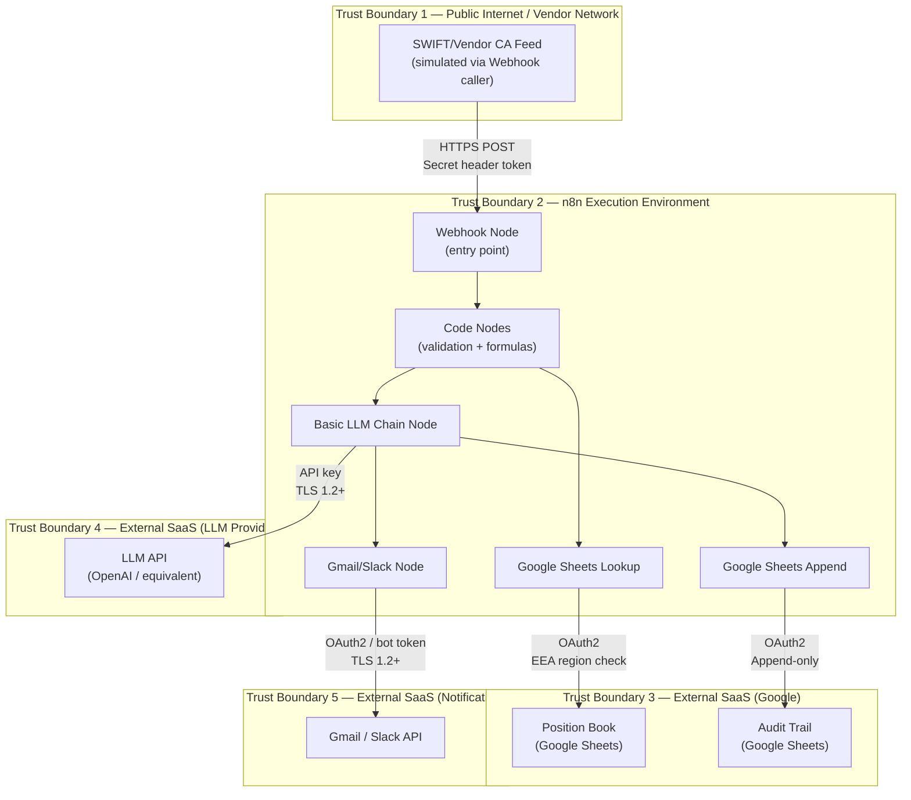

# 03a — Security Architecture

**Workflow ID:** BK1
**Document:** 03a-security-architecture.md
**Version:** 1.0
**Author role:** Senior AI Solution Architect
**Status:** Approved (2026-08-17)
**Last updated:** 2026-07-30

---

## How this fits

This document consumes `02-architecture-spec.md` (C4 container diagram and integration points) and `03-data-contract.md` (data classification) to produce the security architecture for BK1. It is consumed by `09-governance-boundaries.md` (SOC2-SEC-001 traceability). It cross-references NFR-003, SOC2-SEC-001, GDPR-Art44-001 from `requirements.md` by ID.

---

## 1. Trust boundaries

---

## 2. STRIDE threat model

### Trust Boundary 1 → 2: Webhook ingestion

| STRIDE | Threat | Mitigation |
|---|---|---|
| **S**poofing | Malicious actor sends fabricated MT564 payload to trigger erroneous entitlement calculations | Secret header token on Webhook (NFR-003); validation Code node rejects malformed payloads (FR-002) |
| **T**ampering | Attacker modifies event data in transit (ISIN, grossRatePerShare) to alter entitlement | HTTPS enforced by n8n Webhook; TLS 1.2+ in transit; secret token prevents unauthenticated delivery |
| **R**epudiation | No record of which payload triggered which calculation | Audit trail appended per execution (FR-023); `workflowRunId` ties execution to payload (AC-017) |
| **I**nformation disclosure | Payload contains clientId and financial position data in HTTP body | Webhook is HTTPS-only; secret header not logged; n8n execution log access restricted (SOC2-SEC-001) |
| **D**enial of service | Flood of Webhook requests overwhelms n8n | Rate limiting at network/API gateway layer (outside n8n scope); n8n instance uptime monitoring (NFR-002) |
| **E**levation of privilege | Webhook caller gains access to Google Sheets or LLM credential | Webhook caller has no credential access; credentials are in n8n credential store, not in workflow JSON (NFR-003) |

### Trust Boundary 2 → 3: Google Sheets access

| STRIDE | Threat | Mitigation |
|---|---|---|
| **S**poofing | Workflow reads from a different Sheets document than intended | Spreadsheet ID hardcoded as n8n workflow parameter (not credential); sheet tab name validated at runtime |
| **T**ampering | Position book is modified between event ingestion and formula execution | `positionAsOfRecordDate` is a read-only field; the workflow has no write path to the position book |
| **R**epudiation | Audit trail row deleted or modified after append | Audit trail is append-only by workflow design (FR-024); Google Sheets does not enforce immutability — see ADR-002 production gap |
| **I**nformation disclosure | OAuth2 token leaked | Token stored in n8n credential store; not exported in workflow JSON (`SETUP.md` rule 4) |
| **D**enial of service | Sheets API rate limit hit | n8n node has built-in retry; for MVP single-event processing, rate limits are not a risk |
| **E**levation of privilege | OAuth2 scope too broad | OAuth2 scope must be limited to the specific spreadsheet; principle of least privilege |

### Trust Boundary 2 → 4: LLM API access

| STRIDE | Threat | Mitigation |
|---|---|---|
| **S**poofing | Response from a different LLM provider is injected | TLS 1.2+ with provider certificate validation; n8n LLM node uses authenticated endpoint |
| **T**ampering | LLM response is tampered in transit to insert incorrect financial figures | LLM output is treated as draft text only; post-LLM validation checks no new figures appear (DQ-011, AC-014) |
| **R**epudiation | No record of what was sent to LLM or received back | n8n execution log captures prompt and response; EUAIACT-LOG-001 |
| **I**nformation disclosure | clientId and entitlement figures sent to LLM provider (third-party SaaS) | Only pseudonymous clientId and pre-computed figures sent — no name, address, or special-category data; GDPR-Art5-001 data minimisation |
| **Prompt injection** | `optionDetails[].description` field contains adversarial instructions that redirect LLM behaviour | Prompt structure passes event fields as labelled variables in a fixed template; system-level instruction establishes role and prohibits deviation; input sanitisation strips markdown/code formatting from description field |
| **E**levation of privilege | LLM instructed to call tools or access external systems | Basic LLM Chain node has no tool-calling capability — structurally prohibited (ADR-001) |

---

## 3. Zero Trust access design

| Principle | Implementation |
|---|---|
| Verify explicitly | Every external call (Sheets, LLM, Gmail/Slack) uses an individually scoped credential stored in n8n credential store — no shared keys |
| Least privilege | Google Sheets OAuth2 scope limited to the specific spreadsheet; LLM API key has no admin scope; Gmail/Slack token limited to send-only |
| Assume breach | Audit trail (FR-023) ensures all processing is reconstructible even if an upstream system is compromised; `workflowRunId` provides correlation |
| No credential in workflow JSON | Per `SETUP.md` rule 4: all credential fields in the exported template must be empty placeholders before publishing |

---

## 4. Secrets & credential handling

| Credential | Type | Storage | Scope | Rotation policy |
|---|---|---|---|---|
| Webhook secret header token | String token | n8n credential store (Header Auth type) | Webhook ingestion only | Rotate on staff change or suspected compromise |
| Google Sheets OAuth2 | OAuth2 (Google) | n8n credential store | Single spreadsheet — read (position book) + append (audit trail) | Follow Google Workspace OAuth rotation policy |
| LLM provider API key | API key | n8n credential store | LLM inference only — no admin or fine-tuning scope | Rotate quarterly; reviewed per ISO42001-LC-001 |
| Gmail OAuth2 / Slack bot token | OAuth2 / Bearer | n8n credential store | Send-only | Rotate on staff change or suspected compromise |

> **Export rule:** The exported n8n workflow JSON **must** have all credential fields set to empty placeholders (`""` or `null`) before publication to n8n Marketplace. Never export with a live credential. Enforced per `SETUP.md`.

---

## 5. Data-in-transit controls

All external communications use HTTPS / TLS 1.2+:
- Webhook: HTTPS enforced by n8n (self-hosted must terminate TLS at reverse proxy; n8n Cloud enforces it)
- Google Sheets API: HTTPS (Google-enforced)
- LLM API: HTTPS (provider-enforced)
- Gmail SMTP / Slack API: HTTPS (provider-enforced)

Data at rest:
- Google Sheets: encrypted at rest by Google (Google-managed keys)
- n8n credential store: encrypted at rest by n8n (self-hosted: key derived from `N8N_ENCRYPTION_KEY`; n8n Cloud: managed)

---

## 6. Access control

Per SOC2-SEC-001: access to the following must be restricted to authorised personnel and reviewed annually:

| Resource | Access type | Authorised roles |
|---|---|---|
| n8n workflow (edit) | n8n editor access | Workflow Engineer; Corporate Actions Operations Lead |
| n8n workflow (view/run) | n8n viewer / executor access | Corporate Actions Ops; Asset Servicing Risk & Control |
| Google Sheets position book | Editor (for data population); Viewer (workflow) | Data Governance Lead (editor); n8n OAuth2 service account (viewer) |
| Google Sheets audit trail | Viewer + append via API; no direct UI edit | Asset Servicing Risk & Control (viewer); n8n OAuth2 service account (append) |
| n8n execution log | n8n admin | Workflow Engineer; Compliance Officer (read-only) |
