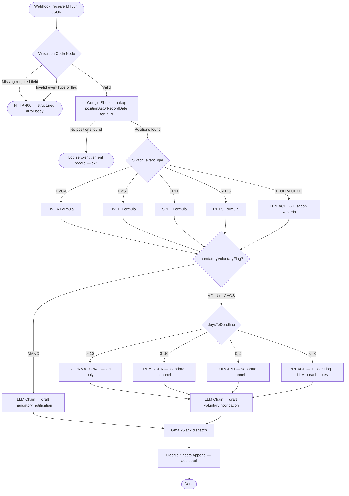

# 04 — Deterministic Logic Specification

**Workflow ID:** BK1
**Document:** 04-deterministic-logic-spec.md
**Version:** 1.0
**Author role:** Senior AI Solution Architect
**Status:** Approved (2026-08-17)
**Last updated:** 2026-07-30

---

## How this fits

This document expands `requirements.md` §4 (functional requirements) and §6.5 (entitlement formulas) into pseudocode and flowchart form sufficient for a second engineer to reimplement BK1 without access to the original author. It is consumed by `05-test-plan-edge-matrix.md` (test derivation from logic branches). It does not restate requirements — it references by ID.

---

## 1. Constants block (required at top of every Code node — NFR-006)

```javascript
// === BK1 CONSTANTS — do not use inline literals elsewhere in this node ===
const ROUNDING_DP          = 2;          // decimal places for cash entitlement (FR-006)
const TIER_INFORMATIONAL   = 10;         // daysToDeadline > 10 (FR-013)
const TIER_REMINDER_MAX    = 10;         // daysToDeadline 3–10 (FR-014)
const TIER_REMINDER_MIN    = 3;          // daysToDeadline 3–10 (FR-014)
const TIER_URGENT_MAX      = 3;          // daysToDeadline 0–3 (FR-015)
const TIER_BREACH          = 0;          // daysToDeadline <= 0 (FR-016)
```

---

## 2. Master workflow flowchart



---

## 3. Validation pseudocode (FR-001 to FR-003)

```
function validate(payload):
  REQUIRED_FIELDS = ['eventId', 'isin', 'eventType', 'mandatoryVoluntaryFlag', 'recordDate']
  VALID_EVENT_TYPES = ['DVCA', 'DVSE', 'SPLF', 'RHTS', 'TEND', 'CHOS']
  VALID_FLAGS = ['MAND', 'VOLU', 'CHOS']

  for field in REQUIRED_FIELDS:
    if payload[field] is null or empty:
      return HTTP_400({ error: 'MISSING_FIELD', field: field })

  if payload.eventType not in VALID_EVENT_TYPES:
    return HTTP_400({ error: 'INVALID_EVENT_TYPE', value: payload.eventType })

  if payload.mandatoryVoluntaryFlag not in VALID_FLAGS:
    return HTTP_400({ error: 'INVALID_FLAG', value: payload.mandatoryVoluntaryFlag })

  if payload.mandatoryVoluntaryFlag in ['VOLU', 'CHOS'] and payload.electionDeadline is null:
    return HTTP_400({ error: 'MISSING_ELECTION_DEADLINE' })

  return { valid: true, payload: payload }
```

---

## 4. Formula pseudocode per event type

### 4.1 DVCA — Cash dividend (FR-006)

```
function calculate_DVCA(position, grossRatePerShare):
  // position = positionAsOfRecordDate — NEVER a current/live position field
  if position == 0:
    return { entitlementCash: 0.00, entitlementShares: null, newPosition: null }

  raw = position * grossRatePerShare
  entitlementCash = roundHalfUp(raw, ROUNDING_DP)  // half-up, 2 d.p.
  return { entitlementCash: entitlementCash, entitlementShares: null, newPosition: null }

function roundHalfUp(value, dp):
  factor = 10 ** dp
  return Math.floor(value * factor + 0.5) / factor
```

**Critical:** `Math.round()` uses banker's rounding (round-half-to-even) in JavaScript — do NOT use it. Always use `roundHalfUp()` as defined above.

### 4.2 DVSE — Stock dividend (FR-007)

```
function calculate_DVSE(position, stockDividendRatio, fractionalCashPrice):
  if position == 0:
    return { entitlementShares: 0, fractionalCash: 0.00 }

  rawShares = position * stockDividendRatio
  entitlementShares = Math.floor(rawShares)          // whole shares only
  fractionalRemainder = rawShares - entitlementShares // always 0 ≤ remainder < 1
  fractionalCash = roundHalfUp(fractionalRemainder * fractionalCashPrice, ROUNDING_DP)
  return { entitlementShares: entitlementShares, fractionalCash: fractionalCash }
```

**Edge case:** If `fractionalRemainder == 0`, `fractionalCash = 0.00` — must still be logged, not null.

### 4.3 SPLF — Forward split (FR-008)

```
function calculate_SPLF(position, splitRatioString):
  // splitRatioString format: "a:b" e.g. "3:1"
  parts = splitRatioString.split(':')
  a = parseInt(parts[0])
  b = parseInt(parts[1])
  newPosition = position * (a / b)
  // newPosition may be non-integer — log as-is; no rounding rule specified
  return { newPosition: newPosition, entitlementCash: 0, entitlementShares: 0 }
```

### 4.4 RHTS — Rights issue (FR-009)

```
function calculate_RHTS(position, rightsRatio, mandatoryVoluntaryFlag):
  rightsEntitlement = position * rightsRatio

  if mandatoryVoluntaryFlag == 'MAND':
    // Auto-credit (mandatory rights issue)
    return { rightsEntitlement: rightsEntitlement, electionStatus: 'AUTO_CREDIT' }
  else:
    // VOLU or CHOS — hold as pending election, do NOT credit
    return { rightsEntitlement: rightsEntitlement, electionStatus: 'PENDING_ELECTION' }
```

### 4.5 TEND / CHOS — Election tracking (FR-010)

```
function calculate_TEND_CHOS(position, optionDetails):
  // No automatic entitlement — one tracking record per option
  records = []
  for option in optionDetails:
    records.push({
      optionCode: option.optionCode,
      description: option.description,
      ratio: option.ratio,
      price: option.price,
      electionStatus: 'PENDING_ELECTION',
      position: position
    })
  return records   // length == optionDetails.length; minimum 1 record
```

---

## 5. Deadline escalation pseudocode (FR-012 to FR-016)

```
function compute_escalation_tier(electionDeadline, today):
  // Both dates are ISO 8601; difference in whole days, truncated
  deadlineDate = parseDate(electionDeadline)  // UTC midnight
  todayDate    = parseDate(today)             // UTC midnight
  daysToDeadline = Math.floor((deadlineDate - todayDate) / MS_PER_DAY)

  if daysToDeadline > TIER_INFORMATIONAL:
    return { tier: 'INFORMATIONAL', daysToDeadline: daysToDeadline }
  else if daysToDeadline >= TIER_REMINDER_MIN:
    return { tier: 'REMINDER', daysToDeadline: daysToDeadline }
  else if daysToDeadline > TIER_BREACH:
    return { tier: 'URGENT', daysToDeadline: daysToDeadline }
  else:
    return { tier: 'BREACH', daysToDeadline: daysToDeadline, incidentFlag: true }
```

**Boundary conditions (must be tested — see TC-003, TC-004):**
- `daysToDeadline = 3` → REMINDER (inclusive lower bound of TIER_REMINDER_MIN)
- `daysToDeadline = 0` → BREACH (not URGENT — zero days remaining is a breach)
- `daysToDeadline = -1` → BREACH (past deadline — irreversible)

---

## 6. Audit trail record assembly pseudocode (FR-023 to FR-025)

```
function build_audit_record(event, position, entitlementResult, escalation, workflowRunId, llmOutput):
  return {
    eventId:                event.eventId,
    isin:                   event.isin,
    clientId:               position.clientId,
    eventType:              event.eventType,
    mandatoryVoluntaryFlag: event.mandatoryVoluntaryFlag,
    positionAsOfRecordDate: position.positionAsOfRecordDate,
    entitlementCash:        entitlementResult.entitlementCash   ?? null,
    entitlementShares:      entitlementResult.entitlementShares ?? null,
    fractionalCash:         entitlementResult.fractionalCash    ?? null,
    newPosition:            entitlementResult.newPosition       ?? null,
    electionStatus:         entitlementResult.electionStatus    ?? null,
    daysToDeadline:         escalation?.daysToDeadline          ?? null,
    escalationTier:         escalation?.tier                    ?? 'N/A',
    incidentFlag:           escalation?.incidentFlag            ?? false,
    breachNotes:            (escalation?.tier == 'BREACH') ? llmOutput.breachNotes : null,
    processingTimestampUTC: new Date().toISOString(),
    workflowRunId:          workflowRunId
  }
```

---

## 7. LLM prompt assembly pseudocode (FR-017)

```
function build_llm_prompt(event, entitlementResult, escalation, options):
  // Sanitise all event-sourced string fields before prompt insertion
  sanitised_options = options.map(o => ({
    ...o,
    description: sanitise_for_prompt(o.description)  // strip HTML, markdown code blocks, injection patterns
  }))

  // All financial figures are passed as locked variables — never ask LLM to compute them
  locked_inputs = {
    clientId:         event.clientId,              // string only — no computation
    isin:             event.isin,
    eventType_label:  HUMAN_READABLE[event.eventType],
    entitlement_summary: format_entitlement(entitlementResult),  // pre-formatted string
    paymentDate:      event.paymentDate,
    electionDeadline: event.electionDeadline ?? 'N/A',
    optionDetails_formatted: format_options(sanitised_options),
    defaultOption:    event.defaultOption ?? 'N/A'
  }

  return build_prompt_from_template(locked_inputs)  // see 03b §4.1 for template
```
